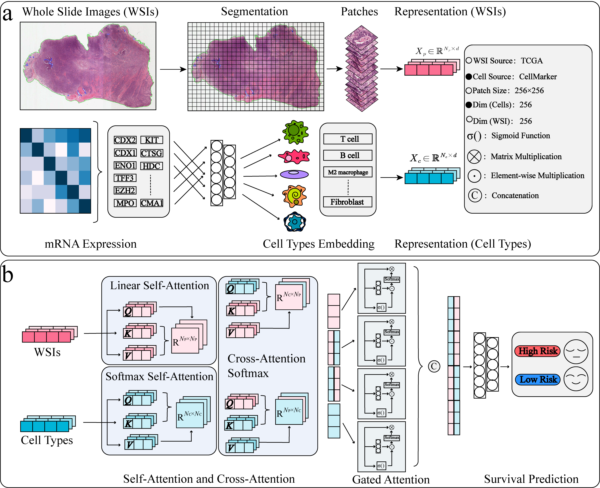

# SurvTransformer：Interpretable Cancer Survival Prediction by Fusing Semantic Labelling of Cell Types and Whole Slide Images

Survival prediction involves multiple factors, such as histopathological image data and omics data, making it a typical multimodal task. In this work, we introduce semantic annotations for genes in different cell types based on cell biology knowledge, enabling the model to achieve interpretability at the cellular level. Since these cell type annotations are derived from the unique sites of origin for each cancer type, they can be more closely aligned with morphological features in whole slide images (WSIs) and address the issue of genomic annotation ambiguity. We then propose a multimodal fusion model, SurvTransformer, with multi-layer attention to fuse cell type tags (CTTs) and WSIs for survival prediction. Finally, through attention and integrated gradient attribution, the model provides biologically meaningful interpretable analysis at three different levels: cell type, gene, and histopathology image. Comparative experiments show that SurvTransformer achieves the highest consistency index across four cancer datasets. The survival curves generated are also statistically significant. Ablation experiments show that SurvTransformer outperforms models based on different labeling methods and attention representations. In terms of interpretability, case studies validate the effectiveness of SurvTransformer at three levels: cell type, gene, and histopathological image.

# Note
The code will be provided as needed.

# Acknowledgement
Thanks to the following people for their work.
* Jaume G, Vaidya A, Chen R J, et al. Modeling dense multimodal interactions between biological pathways and histology for survival prediction[C]//Proceedings of the IEEE/CVF Conference on Computer Vision and Pattern Recognition. 2024: 11579-11590.
