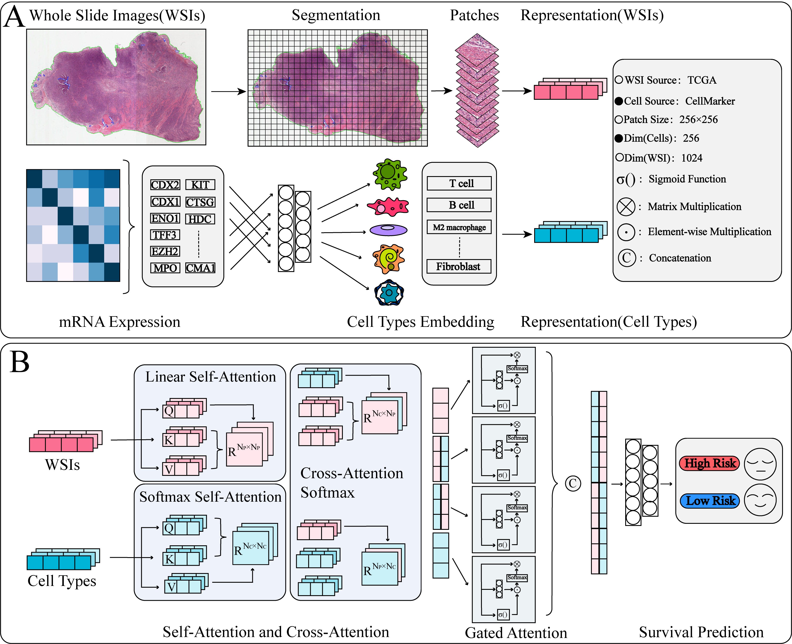

SurvTransformer：A multimodal fusion model based on semantic labelling of cell types and multilayer interpretation for cancer survival prediction

The survival prediction task is a multimodal task driven by multiple factors including histological features, clinical data and genomics. In this study, for the first time, we generated semantic markers at the level of different cell types based on knowledge of cell biology. This approach was employed to address the problem of ambiguous genomic tokenisation and the inability of markers to be aligned with morphological features in histological whole slide images (WSIs). A multimodal fusion model, designated SurvTransformer with multilayer attention, is proposed for the purpose of fusing cell type tags (CTTs) and WSIs for the prediction of survival. Furthermore, this study introduced a multilevel interpretable mechanism with biologically meaningful interpretable analyses at the cell type, gene and WSIs levels, providing unique insights for exploring genotype-phenotype interactions and discovering new biomarkers. In the course of the experimental analyses, SurvTransformer conducted a comprehensive comparison and ablation study on four distinct cancer datasets, thereby demonstrating its exceptional predictive capabilities.

# Acknowledgement
Thanks to the following people for their work.
* Jaume, G., et al., Modeling dense multimodal interactions between biological pathways and histology for survival prediction.
